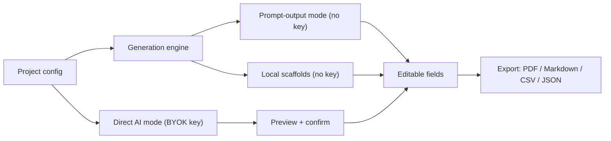

# RouteCrafter Documentation

Welcome to the RouteCrafter documentation. RouteCrafter is a browser-based studio
for producing premium, country-specific travel itinerary products and the
marketplace listing assets that sell them.

These docs are organized into four layers: **product**, **how-to guides**,
**architecture**, and **development**. Start with the product overview if you are
new, the user guide if you want to use the app, or the architecture section if you
want to understand or extend the code.

## Product

| Doc | What it covers |
| --- | --- |
| [Product overview](product/overview.md) | Vision, target users, value props, feature catalog, the two operating modes, and core principles. |

## Guides

| Doc | What it covers |
| --- | --- |
| [Getting started](guides/getting-started.md) | Prerequisites, install, dev scripts, where your data lives, seeded demo projects, and the five-stage production route. |
| [User guide](guides/user-guide.md) | End-to-end walkthrough: dashboard, creating a project, and the Define, Plan, Build, Package, Publish workflow. |
| [AI setup (BYOK)](guides/ai-setup.md) | Configuring OpenAI / Anthropic / Gemini keys, model defaults, connection tests, preview-before-apply, merge modes, and security caveats. |

## Architecture

| Doc | What it covers |
| --- | --- |
| [Architecture overview](architecture/overview.md) | High-level system map, layer diagram, directory structure, design principles. |
| [Data model](architecture/data-model.md) | The `Project` aggregate, all nested entities, enums, the ER diagram, normalization, and the JSON import/export format. |
| [Generation engine](architecture/generation-engine.md) | The pure `src/lib/generation` engine: context, registry, the 13 prompt templates, the 4 scaffold builders, and realism rules. |
| [AI integration](architecture/ai-integration.md) | The BYOK proxy: providers, task types, API routes, output parsing, the `AiRunSheet` workflow, and security. |
| [State & persistence](architecture/state-and-persistence.md) | The Zustand stores, `localStorage` persistence, normalization on hydrate, and the SSR-safe mount pattern. |
| [UI & design system](architecture/ui-and-design-system.md) | Routing, AppShell/nav, the `components/ui` primitives, the workspace tabs, design tokens, and the PDF builder. |

## Development

| Doc | What it covers |
| --- | --- |
| [Contributing](development/contributing.md) | Conventions, the Next.js 16 caveat, testing with Vitest, CI, and step-by-step guides for adding a prompt template or AI task. |

## The two operating modes (at a glance)

RouteCrafter always works in **prompt-output mode** (copy a generated prompt, run
it in any external LLM, paste the result back into editable fields). It also
supports an opt-in **direct AI mode** where you bring your own provider key and the
app calls the model for you, always behind a preview-before-apply confirmation.

