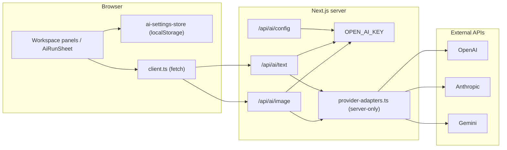

# AI Integration

RouteCrafter's AI layer defaults to server-funded OpenAI and supports personal-key
overrides. `OPEN_AI_KEY` stays inside Next.js route handlers. The browser can store
personal provider keys locally and send one per request to override the server
credential.

For the user-facing setup, see the [AI setup guide](../guides/ai-setup.md).

## Architecture



| Concern | File |
| --- | --- |
| Types | [`src/lib/ai/types.ts`](../../src/lib/ai/types.ts) |
| Provider registry | [`src/lib/ai/providers.ts`](../../src/lib/ai/providers.ts) |
| Server adapters | [`src/lib/ai/provider-adapters.ts`](../../src/lib/ai/provider-adapters.ts) |
| Prompt builders | [`src/lib/ai/tasks.ts`](../../src/lib/ai/tasks.ts) |
| Transport schemas | [`src/lib/ai/schemas.ts`](../../src/lib/ai/schemas.ts) |
| Output parsing | [`src/lib/ai/parse.ts`](../../src/lib/ai/parse.ts) |
| Run metadata | [`src/lib/ai/metadata.ts`](../../src/lib/ai/metadata.ts) |
| Browser client | [`src/lib/ai/client.ts`](../../src/lib/ai/client.ts) |
| API routes | [`src/app/api/ai/text/route.ts`](../../src/app/api/ai/text/route.ts), [`src/app/api/ai/image/route.ts`](../../src/app/api/ai/image/route.ts) |
| Settings store | [`src/lib/store/ai-settings-store.ts`](../../src/lib/store/ai-settings-store.ts) |
| UI | [`src/components/ai/AiRunSheet.tsx`](../../src/components/ai/AiRunSheet.tsx), [`src/components/ai/AiCostButton.tsx`](../../src/components/ai/AiCostButton.tsx) |

## Providers

```1:1:src/lib/ai/types.ts
export type AiProviderId = "openai" | "anthropic" | "gemini";
```

The registry in `providers.ts` describes each provider's capabilities and models:

| Provider | Text | Image | Structured JSON | Default text model | Default image model |
| --- | --- | --- | --- | --- | --- |
| OpenAI | yes | yes | yes | `gpt-5.4` | `gpt-image-2` |
| Anthropic | yes | no | yes | `claude-sonnet-4-6` | — |
| Gemini | yes | yes | yes | `gemini-3.5-flash` | `gemini-3.1-flash-image` |

Helpers: `providerLabel`, `providerSupports`, `resolveTextModel`,
`resolveImageModel` (fall back to defaults when the model string is empty).

### Adapters

`provider-adapters.ts` is marked `"server-only"` and is the only code that talks to
external APIs. The entry points dispatch by provider:

```143:169:src/lib/ai/provider-adapters.ts
export async function generateText(request: AiTextRequest): Promise<AiResult> {
  if (!providerSupports(request.provider, "text")) {
    throw new Error("This provider does not support text generation here.");
  }
  switch (request.provider) {
    case "openai":
      return generateOpenAiText(request);
    case "anthropic":
      return generateAnthropicText(request);
    case "gemini":
      return generateGeminiText(request);
  }
}

export async function generateImage(request: AiImageRequest): Promise<AiResult> {
  if (!providerSupports(request.provider, "image")) {
    throw new Error("This provider does not support image generation here.");
  }
  switch (request.provider) {
    case "openai":
      return generateOpenAiImage(request);
    case "gemini":
      return generateGeminiImage(request);
    case "anthropic":
      throw new Error("This provider does not support image generation here.");
  }
}
```

Per-provider specifics:

| Provider | Text endpoint | Image endpoint | Auth | JSON mode |
| --- | --- | --- | --- | --- |
| OpenAI | `POST /v1/responses` | `POST /v1/images/generations` | `Authorization: Bearer` | `text.format.type: json_object` |
| Anthropic | `POST /v1/messages` | n/a | `x-api-key` | Appends a "return only valid JSON" instruction |
| Gemini | `:generateContent?key=` | same endpoint | API key in query string | `responseMimeType: application/json` |

Notable behaviors: OpenAI text uses the Responses API (not Chat Completions);
Anthropic Opus models omit temperature/top-p; Gemini image responses extract
`inlineData` as a base64 data URL. Errors are normalized (401/403 -> auth failed,
429 -> rate limit, 5xx -> provider unavailable, `AbortError` -> cancelled), and
provider-specific token counts are mapped into a unified `AiUsage`.

## Task types

```3:12:src/lib/ai/types.ts
export type AiTaskType =
  | "brief"
  | "prompt"
  | "itinerary"
  | "matrix"
  | "listing"
  | "imagePrompt"
  | "imageGeneration"
  | "guide"
  | "rewrite";
```

`taskType` is **metadata only** — it is passed through the API and recorded in
`aiRuns`, but does not change server routing. Each task has a prompt builder in
`tasks.ts`:

| Task | Builder | Wired in | Output |
| --- | --- | --- | --- |
| `brief` | `buildBriefExtractionPrompt` | Trip Config form | Trip configuration JSON |
| `prompt` | `buildPromptRunPrompt` | Prompt Studio | Plain text |
| `matrix` | `buildMatrixPrompt` | Matrix panel | Matrix JSON |
| `itinerary` | `buildItineraryPrompt` | Expanded Itinerary | Itinerary JSON |
| `rewrite` | `buildDayPrompt` | Expanded Itinerary (day) | Day JSON |
| `listing` | `buildListingPrompt` | Listing panel | Listing JSON |
| `imagePrompt` | `buildImagePromptImprovementPrompt` | Image Prompts | Image brief JSON |
| `imageGeneration` | `buildImageGenerationPrompt` | Image Prompts, PDF theme controls | Image |
| `guide` | `buildGuidePrompt` | (defined, not wired) | Itinerary JSON |

Every builder injects project context via `configBlock(ctx)` and
`voiceDescription(ctx)` from the generation engine, includes the shorter realism
guardrail (no invented live data), and — for JSON tasks — appends a `jsonOnly(...)`
instruction to return raw JSON with no markdown fences.

## API routes

Both generation routes authenticate, validate with Zod, resolve credentials, call
the adapter, return the result, and disable caching. Resolution order is:

1. A supplied personal key keeps the selected provider and model.
2. Otherwise `OPEN_AI_KEY` forces OpenAI with `gpt-5.4` or `gpt-image-2`.
3. If neither exists, the route returns `503`.

`GET /api/ai/config` is authenticated and returns only server availability plus
the two server model names.

```7:27:src/app/api/ai/text/route.ts
export async function POST(request: Request) {
  try {
    const json = await request.json();
    const parsed = aiTextRequestSchema.safeParse(json);
    if (!parsed.success) {
      return NextResponse.json(
        { error: "Missing or invalid AI text request." },
        { status: 400 },
      );
    }
    const result = await generateText(parsed.data);
    return NextResponse.json(result, {
      headers: { "Cache-Control": "no-store" },
    });
  } catch (error) {
    return NextResponse.json(
      { error: normalizeProviderError(error) },
      { status: 500, headers: { "Cache-Control": "no-store" } },
    );
  }
}
```

### Request / response contract

**Text request** (`aiTextRequestSchema`):

```24:35:src/lib/ai/schemas.ts
export const aiTextRequestSchema = z.object({
  provider: aiProviderIdSchema,
  apiKey: z.string().min(1).optional(),
  model: z.string().min(1),
  prompt: z.string().min(1),
  system: z.string().optional(),
  taskType: aiTaskTypeSchema,
  temperature: z.number().min(0).max(2).optional(),
  topP: z.number().min(0).max(1).optional(),
  maxOutputTokens: z.number().int().min(1).max(32000).optional(),
  responseFormat: z.enum(["text", "json"]).optional(),
});
```

**Image request** adds `size`, `quality`, `aspectRatio` (optional). Note only the
OpenAI image adapter uses `size`/`quality`; `aspectRatio` is currently unused by
adapters.

**Success response** (`AiResult`):

```45:52:src/lib/ai/types.ts
export interface AiResult {
  text?: string;
  image?: string;
  mimeType?: string;
  usage?: AiUsage;
  provider: AiProviderId;
  model: string;
  credentialSource: "server" | "personal";
}
```

**Error response:** `{ error: string }` — HTTP 400 (validation) or 500
(provider/runtime).

### Client / server split

| Concern | Client | Server |
| --- | --- | --- |
| Server key | Never available | Read from `OPEN_AI_KEY` |
| Personal-key storage | `localStorage` via Zustand | Never stored |
| Personal-key transit | Optional in POST body | Forwarded to provider, discarded after request |
| Provider HTTP | — | `provider-adapters.ts` only |
| Prompt construction | `tasks.ts` (client) | — |
| Result parsing | `parseJsonObject` + domain Zod schemas | Raw text/image from provider |

The browser client posts to the route and parses the response:

```17:28:src/lib/ai/client.ts
export async function requestAiText(
  request: AiTextRequest,
  signal?: AbortSignal,
): Promise<AiResult> {
  const response = await fetch("/api/ai/text", {
    method: "POST",
    headers: { "Content-Type": "application/json" },
    body: JSON.stringify(request),
    signal,
  });
  return parseAiResponse(response);
}
```

## Parsing & validation

Provider text is fence-stripped before parsing:

```1:8:src/lib/ai/parse.ts
export function parseJsonObject<T = unknown>(text: string): T {
  const cleaned = text
    .trim()
    .replace(/^```(?:json)?\s*/i, "")
    .replace(/\s*```$/, "")
    .trim();
  return JSON.parse(cleaned) as T;
}
```

There are two validation layers:

1. **Transport** (`schemas.ts`) — validates API request/response shapes.
2. **Domain** — consuming panels parse the JSON and validate it against the relevant
   project schema (`tripConfigurationSchema`, `itineraryMatrixSchema`,
   `marketplaceListingSchema`, `dayPlanSchema`, `portfolioImagePromptSchema`) before
   it can be applied.

`AiRunSheet` accepts an optional `validateText` callback so a panel can block "apply"
on bad JSON/schema before anything touches the project.

## The AI Run Sheet workflow

`AiRunSheet` enforces preview-before-apply. State machine:
`idle -> running -> result | error`.

1. Show the prompt preview, provider/model, and a **Billable** warning.
2. User confirms; the fetch is abortable.
3. For text: side-by-side current vs editable proposal. For image: a preview.
4. **Apply** via panel-defined merge modes: **replace**, **fill-empty**, or
   **append**.
5. Nothing is written to the project until the user applies.

The request includes a personal key only when the selected provider has one.
Otherwise the client sends no key and the route resolves server OpenAI:

```ts
await requestAiText({
  provider: selection.provider,
  apiKey: personalKey || undefined,
  model: selection.model,
  prompt,
  taskType,
  maxOutputTokens: textDefaults.maxOutputTokens,
});
```

## Cost and usage

`pricing.ts` contains centralized standard pricing for built-in models. Text
estimates combine a conservative prompt-token range with task-specific expected
output and the configured output cap. Image estimates use published per-image
costs for the selected size and quality. Unknown/custom models return no estimate.

`AiCostButton` computes a compact `Est. $X-$Y` badge from the active run
selection. `AiRunSheet` repeats the range with its pricing basis and payer.

When a result is applied, `createAiRunMetadata` records a run on `project.aiRuns`
(provider, model, credential source, task type, token/image usage, timestamps),
never the key or prompt payload. This feeds the AI-usage export appendix.

## Settings store

The AI settings store persists to `localStorage` under
`routecrafter:ai-settings:v1`. It holds per-provider settings (key, custom models,
last-test status), text defaults (provider, model, temperature `0.7`, top-p `0.9`,
max tokens `4000`), and image defaults (provider, model, size `1024x1024`, quality
`medium`, aspect ratio `1:1`). The two safety flags are forced `true` on rehydrate:

```81:82:src/lib/store/ai-settings-store.ts
      requirePreviewBeforeApply: true,
      showBillableConfirmation: true,
```

See [State & persistence](state-and-persistence.md) for the persistence mechanics.

## Security considerations {#security-considerations}

| Topic | Behavior | Risk |
| --- | --- | --- |
| Server key | Read from `OPEN_AI_KEY` only in server modules | Never returned by `/api/ai/config` or generation responses |
| Personal-key storage | Plaintext in `localStorage` | XSS / shared-device exposure |
| Personal-key transit | Browser -> Next.js route -> provider, same request | Visible in DevTools network tab |
| Personal-key persistence | None on the server | Browser-owned override only |
| Route auth | Valid RouteCrafter JWT session required in Proxy and route handlers | Server-funded access remains authenticated |
| Export | AI-usage appendix excludes keys and prompts | Safe to share exports |

The Settings page distinguishes RouteCrafter server OpenAI from personal-key
overrides and retains the shared-device warning for browser-stored personal keys.

## Gaps / reserved code

- The `guide` task type and `buildGuidePrompt` are defined but not wired to the UI
  (itinerary "guide" actions use `buildItineraryPrompt` with focus strings).
- `resolveTextModel` / `resolveImageModel` exist but `AiRunSheet` uses the
  defaults directly (custom models are synced into defaults via Settings).
- `aspectRatio` is stored and sent but not consumed by adapters.
- There is no server-side rate limiting beyond provider 401/403/429 handling.
