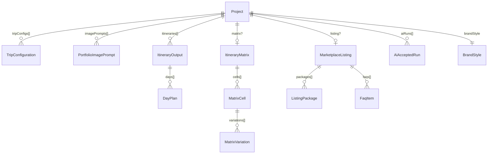

# Data Model

RouteCrafter uses **Zod schemas as the single source of truth**. TypeScript types
are inferred with `z.infer<>` and re-exported (notably from
[`src/lib/types.ts`](../../src/lib/types.ts)) so domain types and validation can
never drift apart. Validation, defaults, normalization, and import/export all flow
through these schemas.

Schemas live in [`src/lib/schemas`](../../src/lib/schemas):

| File | Contents |
| --- | --- |
| [`enums.ts`](../../src/lib/schemas/enums.ts) | All canonical option sets (durations, traveler types, styles, etc.). |
| [`project.ts`](../../src/lib/schemas/project.ts) | The `Project` aggregate, `BrandStyle`, schema version. |
| [`trip-config.ts`](../../src/lib/schemas/trip-config.ts) | `TripConfiguration` + `createEmptyTripConfig`. |
| [`itinerary.ts`](../../src/lib/schemas/itinerary.ts) | `DayPlan`, `ItineraryOutput`, matrix schemas. |
| [`listing.ts`](../../src/lib/schemas/listing.ts) | `MarketplaceListing`, packages, FAQs. |
| [`image-prompt.ts`](../../src/lib/schemas/image-prompt.ts) | `PortfolioImagePrompt` + image-prompt kinds. |
| [`ai.ts`](../../src/lib/schemas/ai.ts) | `AiAcceptedRun` (run metadata recorded on the project). |
| [`index.ts`](../../src/lib/schemas/index.ts) | Barrel re-export. |

## Entity relationships

The `Project` is the **aggregate root**. Everything else is contained within it
(by nesting or optional fields); there are no cross-entity foreign keys.



Relationships are **hierarchical, not relational**: a project may have many trip
configs and itineraries, an optional single matrix and listing, and a flat map of
generated prompt text. The matrix and the itineraries are not linked by id; the
matrix is a planning grid and itineraries are independent documents.

## `Project`

The root entity, defined by `projectSchema`.

**Required (no default):** `id: string`, `name: string` (min length 1),
`createdAt: string` (ISO), `updatedAt: string` (ISO).

**Defaulted / optional:**

| Field | Type | Default | Notes |
| --- | --- | --- | --- |
| `schemaVersion` | `number` (int) | `2` | Stamped on normalization. |
| `country` | `string` | `""` | |
| `regions` | `string[]` | `[]` | Cities/regions. |
| `positioning` | `string` | `""` | Product angle. |
| `targetAudience` | `string` | `""` | |
| `travelStyles` | `TravelStyle[]` | `[]` | Product-level style tags. |
| `travelerTypes` | `TravelerType[]` | `[]` | |
| `durations` | `Duration[]` | `[]` | |
| `deliverables` | `Deliverable[]` | `[]` | |
| `brandStyle` | `BrandStyle` | parsed empty object | Nested defaults. |
| `tripConfigs` | `TripConfiguration[]` | `[]` | |
| `imagePrompts` | `PortfolioImagePrompt[]` | `[]` | |
| `matrix` | `ItineraryMatrix` | optional | Absent until generated. |
| `itineraries` | `ItineraryOutput[]` | `[]` | |
| `listing` | `MarketplaceListing` | optional | |
| `generated` | `Record<string, string>` | `{}` | Raw prompt text keyed by template id. |
| `aiRuns` | `AiAcceptedRun[]` | `[]` | Billable AI metadata (no keys/payloads). |
| `status` | `ProjectStatus` | `"Draft"` | |
| `accent` | `Accent` | `"sage"` | UI theme accent. |

The current schema version is defined as:

```17:17:src/lib/schemas/project.ts
export const CURRENT_SCHEMA_VERSION = 2;
```

## `BrandStyle`

| Field | Type | Default |
| --- | --- | --- |
| `businessName` | `string` | `""` |
| `voice` | `BrandVoice` | `"editorial"` |
| `footerDisclaimer` | `string` | "Live opening hours, prices, tickets, and availability should be verified before travel." |

## `TripConfiguration`

The structured trip input that drives generation. Defined by
`tripConfigurationSchema`. **Required:** `id`, `updatedAt`.

| Field | Type | Default |
| --- | --- | --- |
| `label` | `string` | `"Primary configuration"` |
| `cities` | `string[]` | `[]` |
| `duration` | `Duration` | `"7 days"` |
| `customDays` | `number?` | undefined (int, 1-60) |
| `travelerType` | `TravelerType` | `"Couple"` |
| `travelStyles` | `TravelStyle[]` | `[]` |
| `pace` | `Pace` | `"Balanced"` |
| `budget` | `Budget` | `"Mid-range"` |
| `accommodation` | `Accommodation[]` | `[]` |
| `food` | `FoodPref[]` | `[]` |
| `transport` | `TransportPref[]` | `[]` |
| `interests` | `Interest[]` | `[]` |
| `constraints` | `Constraint[]` | `[]` |
| `seasonMonth` | `string` | `""` |
| `arrivalCity` / `departureCity` | `string` | `""` |
| `arrivalTime` / `departureTime` | `string` | `""` |
| `mustSee` / `avoid` | `string[]` | `[]` |
| `specialOccasion` | `string` | `""` |
| `deliverables` | `Deliverable[]` | `[]` |

`customDays` has special preprocessing — blank or `NaN` becomes `undefined`,
otherwise it must be a positive integer at most 60:

```27:35:src/lib/schemas/trip-config.ts
  customDays: z.preprocess(
    (value) => (value === "" || Number.isNaN(value) ? undefined : value),
    z
      .number()
      .int("Custom days must be a whole number.")
      .positive("Custom days must be at least 1.")
      .max(60, "Custom days must be 60 or fewer.")
      .optional(),
  ),
```

`createEmptyTripConfig(overrides?)` generates a UUID `id` and ISO `updatedAt`, then
parses through the schema to apply defaults.

## Itinerary entities

### `DayPlan`

A single day in an itinerary. **Required:** `day` (positive int), `title`. All other
fields default to `""` (or optional), including `base`, `morning`, `lunch`,
`afternoon`, `evening`, `dinner`, `transportNotes`, `bookingNotes`,
`walkingIntensity`, `optionalUpgrade`, `lowEnergyAlternative`,
`rainyDayAlternative`, `whyThisWorks`, and `image`. `pace` is an optional `Pace`.

### `ItineraryOutput`

A full sellable itinerary. **Required:** `id`, `title`, `country`, `duration`,
`travelerType`, `createdAt`, `updatedAt`.

> Note: `duration` here is a free-form `string` (e.g. `"7 days"`), not the
> `Duration` enum — itineraries can have custom lengths.

Defaulted fields include `subtitle`, `overview`, `whoFor`, `routeSummary`,
`bestStayAreas`, `days: DayPlan[]` (`[]`), `foodGuide`, `transportGuide`,
`packingList`, `etiquetteSafety`, `bookingChecklist`, `personalizationQuestions`,
`verificationNotes`, `pdfTheme: PdfTheme` (`"beige"`), and `coverImage` (`""`).
Optional: `style: TravelStyle`, `budget: Budget`.

### Matrix entities

- `MatrixVariation`: `label: string` (required), `spine: string` (default `""`).
- `MatrixCell`: `duration: Duration` (enum, required), `travelerType: TravelerType`
  (required), `variations: MatrixVariation[]` (`[]`).
- `ItineraryMatrix`: `id: string` (required), `cells: MatrixCell[]` (`[]`),
  `updatedAt: string` (required).

## `PortfolioImagePrompt`

A creative brief for one portfolio image. **Required:** `id`, `kind`, `title`,
`goal`, `canvas`, `layout`, `visualElements`, `textOverlay`, `style`,
`negativePrompt`, `countryAccuracyNotes`, `readabilityNotes`. Defaulted: `image`
(`""`), `isFinal` (`false`).

There are five fixed `kind` values: `hero`, `what-youll-get`, `sample-itinerary`,
`beyond-the-brochure`, `built-around-style`.

## `MarketplaceListing`

A single optional listing per project (no `id`/timestamps). All fields default:

| Field | Type | Default |
| --- | --- | --- |
| `titleOptions` | `string[]` | `[]` |
| `tags` | `string[]` | `[]` |
| `shortDescription` | `string` | `""` |
| `longDescription` | `string` | `""` |
| `packages` | `ListingPackage[]` | `[]` |
| `faqs` | `FaqItem[]` | `[]` |
| `buyerRequirements` | `string[]` | `[]` |
| `upsells` | `string[]` | `[]` |
| `deliveryNotes` | `string` | `""` |

- `ListingPackage`: `name` (required), `price` (`""`), `description` (`""`),
  `features: string[]` (`[]`).
- `FaqItem`: `question`, `answer` (both required).

## `AiAcceptedRun`

Append-only audit metadata recorded when an AI result is applied. **Excludes API
keys and prompt payloads** by design.

| Field | Type | Notes |
| --- | --- | --- |
| `id` | `string` | |
| `provider` | `"openai" \| "anthropic" \| "gemini"` | |
| `model` | `string` | |
| `taskType` | `AiTaskType` | see [AI integration](ai-integration.md). |
| `label` | `string` | Human-readable. |
| `createdAt` / `appliedAt` | `string` | |
| `usage` | object? | `inputTokens`, `outputTokens`, `totalTokens`, `images` (all optional). |
| `source` | `string?` | |

## Enums

All enums are defined once in [`enums.ts`](../../src/lib/schemas/enums.ts) and reused
across schemas, forms, and prompt templates (with `enumValues.*` exposing the option
arrays for UI lists). Image-prompt kinds live in
[`image-prompt.ts`](../../src/lib/schemas/image-prompt.ts).

| Enum | Allowed values |
| --- | --- |
| `Duration` | `3 days`, `5 days`, `7 days`, `10 days`, `14 days` |
| `TravelerType` | `Solo`, `Couple`, `Family`, `Group`, `Senior travelers`, `Luxury travelers`, `Budget travelers`, `Business + leisure` |
| `TravelStyle` | `Classic first-timer`, `Local-first slow travel`, `Food/culture heavy`, `Nature/adventure`, `Romantic`, `Family-friendly`, `Premium comfort`, `Budget-friendly`, `Wellness`, `Photography`, `Shopping`, `Nightlife`, `Spiritual/cultural` |
| `Pace` | `Relaxed`, `Balanced`, `Active`, `Very active` |
| `Budget` | `Budget`, `Mid-range`, `Premium`, `Luxury` |
| `Accommodation` | `Central convenience`, `Boutique`, `Family-friendly`, `Resort`, `Apartment`, `Luxury hotel`, `Budget stay` |
| `FoodPref` | `Local food`, `Street food`, `Fine dining`, `Cafés`, `Vegetarian`, `Vegan`, `Halal`, `Jain`, `Kid-friendly`, `No alcohol` |
| `TransportPref` | `Public transport`, `Private car`, `Self-drive`, `Scenic rail`, `Walking-heavy`, `Low walking`, `Domestic flights allowed` |
| `Interest` | `Landmarks`, `Museums`, `Food`, `Markets`, `Nature`, `Beaches`, `Mountains`, `Temples/churches`, `Architecture`, `Local neighborhoods`, `Shopping`, `Theme parks`, `Nightlife`, `Photography`, `Wellness` |
| `Constraint` | `Mobility limitations`, `Kids`, `Elderly travelers`, `Pregnancy`, `Dietary restrictions`, `Avoid nightlife`, `Avoid strenuous walking`, `Avoid tourist traps`, `Avoid expensive restaurants` |
| `Deliverable` | `PDF`, `Spreadsheet`, `Packing list`, `Map pins`, `Food guide`, `Booking checklist`, `Fiverr listing copy`, `Portfolio image prompts` |
| `ProjectStatus` | `Draft`, `In progress`, `Ready to sell` |
| `Accent` | `sage`, `terracotta`, `teal`, `gold`, `forest` |
| `BrandVoice` | `editorial`, `premium`, `friendly`, `adventurous` |
| `PdfTheme` | `beige`, `sage`, `terracotta`, `teal`, `noir` |
| `ImagePromptKind` | `hero`, `what-youll-get`, `sample-itinerary`, `beyond-the-brochure`, `built-around-style` |

## Normalization

[`src/lib/project-normalization.ts`](../../src/lib/project-normalization.ts) is the
single validation path used by import, `localStorage` hydration, and every store
commit. It exists to:

1. **Apply current defaults** to older or partial data (Zod fills any missing
   fields).
2. **Stamp the current schema version** on every project.
3. **Provide one validation path** so all entry points behave identically.

```13:24:src/lib/project-normalization.ts
/** Apply current nested defaults and stamp the current project schema version. */
export function normalizeProject(raw: unknown): Project {
  if (!raw || typeof raw !== "object") {
    throw new Error("Project data must be an object.");
  }

  return projectSchema.parse({
    ...raw,
    schemaVersion: CURRENT_SCHEMA_VERSION,
  });
}
```

Migration is **default-driven**, not branch-based: there are no per-version `if`
blocks. Re-parsing a v1 project through `projectSchema` fills fields added in v2
(e.g. `pdfTheme`, `coverImage`, per-day `image`, `aiRuns`) with their defaults and
stamps `schemaVersion: 2`. `normalizePersistedProjects` does the same for the whole
persisted Zustand slice (`{ projects, initialized }`).

## Import / export {#import--export}

[`src/lib/io/project-io.ts`](../../src/lib/io/project-io.ts) handles JSON
serialization.

**Format:** a single `Project` object as pretty-printed JSON (2-space indent), MIME
`application/json`. There is no envelope or checksum; the version is carried by
`project.schemaVersion`. The filename is a slug of the project name (falling back to
`routecrafter-project`).

**Export:**

```10:23:src/lib/io/project-io.ts
/** Serialize a project to pretty-printed JSON for download/copy. */
export function exportProjectJson(project: Project): string {
  return JSON.stringify(project, null, 2);
}

/** A safe filename slug for a project export. */
export function projectFileName(project: Project): string {
  const slug =
    project.name
      .toLowerCase()
      .replace(/[^a-z0-9]+/g, "-")
      .replace(/^-+|-+$/g, "") || "routecrafter-project";
  return `${slug}.json`;
}
```

`downloadProjectJson` builds a Blob and triggers a browser download (no server
round-trip).

**Import:**

```40:50:src/lib/io/project-io.ts
/** Parse + validate an imported JSON string against the project schema. */
export function importProjectJson(text: string): ImportResult {
  let data: unknown;
  try {
    data = JSON.parse(text);
  } catch {
    return { ok: false, error: "File is not valid JSON." };
  }

  try {
    return { ok: true, project: normalizeProject(data) };
```

On a Zod failure, the first issue is formatted into a readable message such as
`Invalid project file (name: ...)`. After a successful import, the store assigns a
new id if the imported id collides with an existing project, so imports never
overwrite existing work.

## Cross-references

- Generation reads this model via `GenerationContext` — see
  [Generation engine](generation-engine.md).
- The store persists and normalizes this model — see
  [State & persistence](state-and-persistence.md).
- AI tasks parse model JSON back from providers — see
  [AI integration](ai-integration.md).
