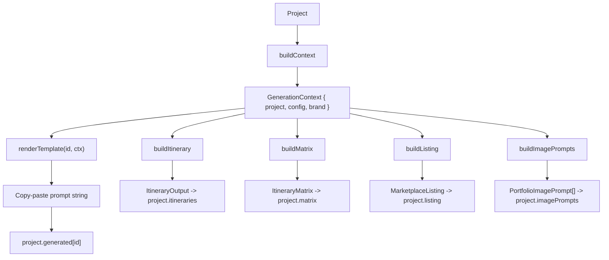

# Generation Engine

The generation engine lives in [`src/lib/generation`](../../src/lib/generation) and
is deliberately **pure and UI-free** — nothing in it imports React. It is the heart
of RouteCrafter's "works without an API key" promise.

It has two parallel responsibilities:

1. **Prompt templates** — pure `(ctx) => string` functions that produce
   copy-paste prompts for external LLMs (ChatGPT, Claude, Gemini, Midjourney).
2. **Scaffold builders** — deterministic functions that produce **structured,
   editable, Zod-validated data** (`ItineraryOutput`, `ItineraryMatrix`,
   `MarketplaceListing`, `PortfolioImagePrompt[]`) locally, with no model call.

```1:6:src/lib/generation/index.ts
/**
 * Generation engine (Phase 4+).
 *
 * Pure, UI-free prompt-template engine. Mode 1 (copy-paste prompts) only; a
 * Phase 12 `generateWithModel(ctx)` can wrap the same `GenerationContext`.
 */
```

## Core types

Everything flows through a single context object and a uniform template contract,
defined in [`types.ts`](../../src/lib/generation/types.ts):

```3:24:src/lib/generation/types.ts
/** Everything a template needs to render, derived once per project. */
export interface GenerationContext {
  project: Project;
  config: TripConfiguration;
  brand: BrandStyle;
}

export type TemplateGroup =
  | "Positioning"
  | "Visuals"
  | "Itinerary"
  | "Listing"
  | "Guides";

export interface PromptTemplate {
  id: string;
  label: string;
  group: TemplateGroup;
  description: string;
  /** Pure function: context in, copy-paste prompt string out. */
  build: (ctx: GenerationContext) => string;
}
```

## Context building

[`context.ts`](../../src/lib/generation/context.ts) turns a `Project` into a
`GenerationContext`, choosing the first trip config (or an empty one seeded from the
project's regions):

```7:17:src/lib/generation/context.ts
/** Build a generation context from a project, filling sensible fallbacks. */
export function buildContext(project: Project): GenerationContext {
  const config =
    project.tripConfigs[0] ??
    createEmptyTripConfig({ cities: project.regions });
  return {
    project,
    config,
    brand: project.brandStyle,
  };
}
```

It also exposes shared prompt helpers used across templates:

| Helper | Purpose |
| --- | --- |
| `durationLabel(ctx)` | `"7 days"` or `"${customDays} days"`. |
| `list(items, fallback)` | Joins arrays; `"not specified"` when empty. |
| `voiceDescription(ctx)` | Maps `brand.voice` to descriptive prose. |
| `configBlock(ctx)` | The compact, multi-line "trip brief" injected into most templates (country, cities, duration, traveler type, styles, pace, budget, accommodation, food, transport, interests, constraints, season, arrival/departure, must-see/avoid, occasion, deliverables, brand voice). |

`configBlock` is the central brief that makes every prompt country- and
config-specific without any hardcoding.

## Registry

Registration is **explicit and static** (no dynamic discovery), in
[`registry.ts`](../../src/lib/generation/registry.ts):

```16:46:src/lib/generation/registry.ts
export const templates: PromptTemplate[] = [
  countryPositioningTemplate,
  visualDirectionTemplate,
  imagePromptsTemplate,
  itineraryMatrixTemplate,
  expandedItineraryTemplate,
  pdfVersionTemplate,
  spreadsheetVersionTemplate,
  listingCopyTemplate,
  buyerRequirementsTemplate,
  faqTemplate,
  packingListTemplate,
  foodGuideTemplate,
  transportGuideTemplate,
];

export const templateRegistry: Record<string, PromptTemplate> =
  Object.fromEntries(templates.map((t) => [t.id, t]));

export function renderTemplate(id: string, ctx: GenerationContext): string {
  return templateRegistry[id]?.build(ctx) ?? "";
}

export function templatesByGroup(): Record<string, PromptTemplate[]> {
  return templates.reduce<Record<string, PromptTemplate[]>>((acc, t) => {
    (acc[t.group] ??= []).push(t);
    return acc;
  }, {});
}
```

- `templates[]` lists all 13 in display order.
- `templateRegistry` is an id -> template map for O(1) lookup.
- `renderTemplate(id, ctx)` calls the matching `build`, or returns `""`.
- `templatesByGroup()` groups templates by `TemplateGroup` for the sectioned Prompt
  Studio UI.

## Context and output flow



Prompt strings are stored on `project.generated` (a `templateId -> string` map);
structured scaffolds are stored on their respective project fields.

## Template catalog (13)

| Group | Id | Label | Output |
| --- | --- | --- | --- |
| Positioning | `country-positioning` | Country positioning | A positioning statement, traveler profiles, premium/local-first differentiators, and expansion angles. |
| Visuals | `visual-direction` | Visual direction | Art direction: palette, typography, photo/illustration style, layout principles, country-specific motifs. |
| Visuals | `image-prompts` | Five portfolio image prompts | The five structured image briefs concatenated into one copy-paste block. |
| Itinerary | `itinerary-matrix` | Itinerary matrix | A compact duration x traveler-type matrix with route variations (1-2 lines/cell). |
| Itinerary | `expanded-itinerary` | Expanded itinerary | A full sellable itinerary prompt (overview, day-by-day with time blocks/backups/rationale, route logic, stays, food, transport, packing, etiquette, checklist, personalization, packaging). |
| Itinerary | `pdf-version` | PDF-style itinerary | Page-by-page printable A4 content. |
| Itinerary | `spreadsheet-version` | Spreadsheet-friendly itinerary | A single CSV/TSV table (day, time block, activity, area, food, transport, booking, cost level, pace, notes, backup). |
| Listing | `listing-copy` | Marketplace listing copy | Gig titles, tags, descriptions, tiered packages, delivery notes, upsells. |
| Listing | `buyer-requirements` | Buyer requirements | Intake form questions grouped by destination, dates, travelers, budget, etc. |
| Listing | `faq` | FAQ | Buyer FAQ including an honest verification disclaimer. |
| Guides | `packing-list` | Packing list | Checklist by category, season/traveler-aware. |
| Guides | `food-guide` | Food & cafe guide | Must-try dishes, food neighborhoods, dietary accommodations, etiquette. |
| Guides | `transport-guide` | Transport guide | Airport arrival, intercity, local transit, passes, taxi/rideshare (cost levels only). |

The richest template is `image-prompts`
([`templates/image-prompts.ts`](../../src/lib/generation/templates/image-prompts.ts)),
which doubles as a structured builder: `buildImagePrompt(kind, ctx)` returns a typed
`PortfolioImagePrompt`, `buildImagePrompts(ctx)` returns all five, and
`imagePromptToText(p)` formats one as a copy-paste block. The Image Prompts panel
uses the structured builders directly.

## Scaffold builders

These produce structured project data locally. They are what the panels' "Generate"
buttons call.

### `buildItinerary` ([`itinerary.ts`](../../src/lib/generation/itinerary.ts))

Creates an `ItineraryOutput` scaffold. It resolves the day count from the duration
string (or `customDays`), then builds one `DayPlan` per day: day 1 is "Arrival &
orientation", the last day is "Final morning & departure", and base cities rotate
across the configured cities/regions (`cities[i % cities.length]`). Time-block fields
stay empty so the user (or AI) fills them — the scaffold provides structure, not
fabricated content.

### `buildMatrix` ([`matrix.ts`](../../src/lib/generation/matrix.ts))

Creates an `ItineraryMatrix` over the project's durations x traveler types (falling
back to sensible defaults). Variation labels adapt to the configuration:

- Always: "Classic First-Timer", "Local-First Slow Travel".
- Adds "Nature / Adventure / Scenic" if styles/interests include nature/mountains.
- Adds "Premium Comfort" if the style is premium or the budget is luxury.

Each variation gets a one-line route **spine** built from up to four cities plus the
variation vibe, pace, duration, and traveler type.

### `buildListing` ([`listing.ts`](../../src/lib/generation/listing.ts))

Creates a `MarketplaceListing` with **substantive starter copy** (unlike the empty
itinerary scaffold): five title options, tags, short/long descriptions, three tiered
packages (Basic/Standard/Premium), FAQs, buyer requirements, and upsells. Prices are
intentionally left blank.

### `buildImagePrompts`

Returns all five `PortfolioImagePrompt` objects (see above).

## Realism rules

[`realism.ts`](../../src/lib/generation/realism.ts) exports three string constants
that are **injected into prompts** — they are policy text, not runtime validators.
Enforcement relies on the human or AI following the appended rules.

```6:30:src/lib/generation/realism.ts
export const REALISM_RULES = `REALISM RULES (must follow):
- No impossible days. Never pack 8-10 attractions into one day.
- Do not group far-apart places in the same half-day unless transport is realistic.
- Group nearby places; reduce backtracking; add travel buffers and rest windows.
- Balance heavy and light days. Account for jet lag on arrival.
- Add rest windows for families, seniors, and very young children.
- Always include low-energy and rainy-day alternatives.
- Be specific: say what, where, and why. Avoid vague lines like "explore the city".
- Recommend food by type and neighborhood, not generic "try local food".
- Explain why each day works (routing logic).

DO NOT FABRICATE:
- Never invent real-time prices, opening hours, ticket availability, or hotel availability.
- Never claim personal travel experience unless explicitly provided.
- Remind the buyer to verify live opening hours, prices, tickets, restaurant and hotel availability before final delivery.`;
```

Injection map:

| Constant | Injected into |
| --- | --- |
| `REALISM_RULES` | `itinerary-matrix`, `expanded-itinerary`, `pdf-version`, `spreadsheet-version` |
| `TRAVELER_ADAPTATION` | `expanded-itinerary` |
| `VERIFICATION_FOOTER` | `pdf-version`, `food-guide`, `transport-guide` |

A parallel, shorter realism string exists in
[`src/lib/ai/tasks.ts`](../../src/lib/ai/tasks.ts) for in-app AI JSON generation —
same philosophy, applied on a different surface. See
[AI integration](ai-integration.md).

## How the UI consumes the engine

| Surface | Uses |
| --- | --- |
| Prompt Studio | `templatesByGroup()` + `renderTemplate`; stores output in `project.generated`. |
| `PromptHelper` (matrix/itinerary/listing panels) | A subset of templates rendered read-only for the copy-paste workflow. |
| Matrix / Itinerary / Listing / Image panels | The matching scaffold builder for the local "Generate" path. |

## Adding a template

1. Create a file in [`templates/`](../../src/lib/generation/templates) exporting a
   `PromptTemplate` constant (id, label, group, description, pure `build`).
2. Import it in [`registry.ts`](../../src/lib/generation/registry.ts) and append it
   to `templates[]` (position controls display order within its group).
3. If it should appear in a specific panel's `PromptHelper`, reference its id there.

Because the contract is a pure function and the registry is the only wiring point,
no UI changes are required for a template to appear in Prompt Studio.
