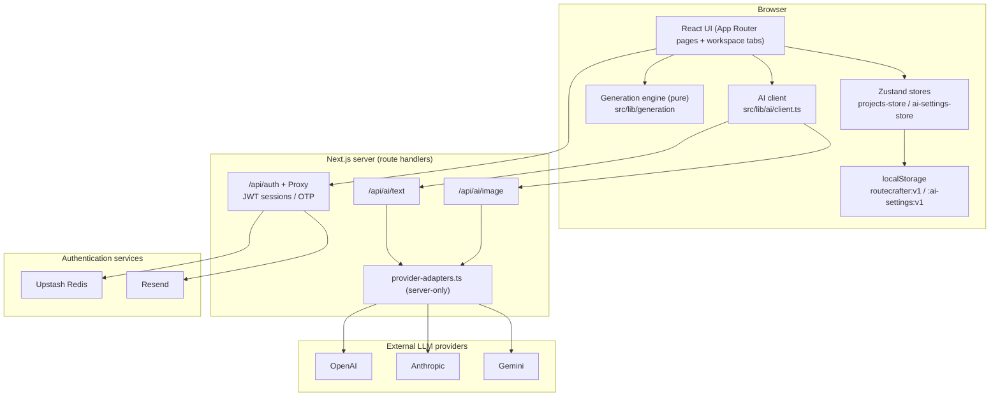

# Architecture Overview

RouteCrafter is a **Next.js 16 (App Router) application** backed by a shared
cloud workspace. Projects and assets are authoritative in Postgres/Vercel Blob,
while the browser keeps a Zustand `localStorage` cache for fast editing and
local-only degradation. The codebase is organized around the **data model** (Zod
schemas), pure project commands, the generation and AI layers, typed browser API
clients, route handlers, and the React UI.

## System map



Project content is shared across authenticated users. Personal AI keys remain in
the private browser settings store; server OpenAI credentials and cloud data stay
server-side.

## Layers

| Layer | Location | Responsibility |
| --- | --- | --- |
| **Data model** | [`src/lib/schemas`](../../src/lib/schemas) | Zod schemas + inferred types; the single source of truth. See [Data model](data-model.md). |
| **Project domain** | [`src/lib/projects`](../../src/lib/projects) | Pure project commands, activity detail generation, and the cloud sync controller. |
| **Normalization & IO** | [`src/lib/project-normalization.ts`](../../src/lib/project-normalization.ts), [`src/lib/io/project-io.ts`](../../src/lib/io/project-io.ts) | Apply schema defaults / migrate; JSON import/export. |
| **Generation engine** | [`src/lib/generation`](../../src/lib/generation) | Pure, UI-free prompt templates + structured scaffold builders + realism rules. See [Generation engine](generation-engine.md). |
| **AI layer** | [`src/lib/ai`](../../src/lib/ai), [`src/app/api/ai`](../../src/app/api/ai) | BYOK provider registry, prompt builders, server adapters, client, parsing, JSON review, and draft progress. See [AI integration](ai-integration.md). |
| **Client API modules** | [`src/lib/client`](../../src/lib/client) | Typed browser-to-route calls with credentials and defensive JSON parsing. |
| **State** | [`src/lib/store`](../../src/lib/store) | Zustand facades with `localStorage` cache and cloud reconciliation. See [State & persistence](state-and-persistence.md). |
| **Authentication** | [`src/lib/auth`](../../src/lib/auth), [`src/app/api/auth`](../../src/app/api/auth) | Signed HttpOnly sessions, password/OTP login, Redis-backed OTP challenges, and rate limiting. |
| **UI** | [`src/app`](../../src/app), [`src/components`](../../src/components) | App Router pages, AppShell, design-system primitives, workspace panels. See [UI & design system](ui-and-design-system.md). |

## Directory structure

```
src/
  app/
    layout.tsx                # Root layout: fonts + AppShell
    globals.css               # Design tokens + document/print styles
    (main)/page.tsx           # Server dashboard shell
    (main)/*/*Client.tsx      # Interactive client leaves
    (main)/projects/          # list, new, [id] workspace
    (main)/templates/page.tsx # template library shell
    (main)/settings/page.tsx  # settings shell
    api/projects/             # shared project workspace APIs
    api/ai/text/route.ts      # server AI text proxy
    api/ai/image/route.ts     # server AI image proxy
  components/
    layout/                   # AppShell, Sidebar, MobileNav, nav, notices
    ui/                        # design-system primitives + field controls
    workspace/                # GuidedWorkspace stages + production tools
    ai/                        # AiRunSheet, AiCostButton
    dashboard/                # ImportProjectButton, etc.
  lib/
    schemas/                  # Zod schemas (project, trip-config, itinerary, ...)
    generation/               # context, registry, templates/, scaffolds, realism
    ai/                        # providers, adapters, tasks, client, review helpers
    client/                   # typed browser API modules
    projects/                 # commands, change detail, sync controller
    itinerary/                # pure itinerary editing and merge helpers
    store/                    # Zustand facades
    io/                        # project-io (import/export)
    project-normalization.ts  # normalize/migrate persisted + imported data
    seed-projects.ts          # first-run demo data
    mock-data.ts              # workspace module registry
    hooks.ts                  # useMounted (SSR-safe hydration)
    utils.ts                  # cn() class merger
```

## Request / data flow

### Local generation (no key)

`Project` -> `buildContext(project)` -> either `renderTemplate(id, ctx)` (copy-paste
prompt string) or a scaffold builder (`buildItinerary`, `buildMatrix`,
`buildListing`, `buildImagePrompts`) producing Zod-validated structured data ->
written into the project via the store.

### Direct AI (with key)

UI assembles a request (provider, key, model, prompt from `tasks.ts`) -> `client.ts`
`fetch` to `/api/ai/text` or `/api/ai/image` -> route validates with Zod ->
`provider-adapters.ts` calls the provider -> result returned -> client parses JSON
and validates against a domain schema -> previewed -> applied to the project.

### Persistence

Every project mutation flows through pure command helpers in
`src/lib/projects/project-commands.ts`, then through the projects store's
`commitProjects`, which normalizes each project, enforces a size cap, and updates
the local cache. `project-sync-controller.ts` reconciles the shared cloud copy,
tracks revisions, handles retries, and creates conflict records.

## Key design principles

1. **Zod schemas are the single source of truth.** Domain TypeScript types are
   inferred (`z.infer`), never hand-written, so validation, defaults, forms, and
   prompts cannot drift apart.
2. **Generation is pure and UI-free.** Templates are `(ctx) => string`; nothing in
   `src/lib/generation` imports React. The UI consumes the engine, never the reverse.
3. **No hardcoded single-country logic.** Country/regions/style flow through
   `GenerationContext` into every template and scaffold.
4. **Usable without an API key.** Prompt-output mode and local scaffolds are the
   default; AI is strictly additive and opt-in.
5. **Never fabricate live data.** Realism rules are injected into itinerary/guide
   prompts and disclaimers, and surfaced as "verify before delivery" reminders.
6. **Preview-before-apply for AI.** No AI output mutates a project until the user
   reviews and confirms it.
7. **Cloud-authoritative persistence.** The cloud (Postgres + Vercel Blob) is the
   source of truth; the browser's `localStorage` is a fast local cache. Portability
   is still available via JSON import/export.
8. **Single shared workspace.** All authenticated accounts read and write the same
   projects, draft state, and assets — there is one global workspace, not private
   per-user workspaces. `user_id` columns are creator/actor attribution only;
   queries are not scoped by user. Concurrent edits use last-write-wins guarded by
   a per-project `revision`, with a conflict prompt (reload or overwrite). Personal
   AI keys, AI provider settings, and UI preferences stay private per user. Roles
   are labels and do not currently enforce permissions.

## Where to go next

- [Data model](data-model.md) — what a `Project` contains.
- [Generation engine](generation-engine.md) — how content is produced.
- [AI integration](ai-integration.md) — how the optional AI layer works.
- [State & persistence](state-and-persistence.md) — how data is stored.
- [UI & design system](ui-and-design-system.md) — how the app is rendered.
