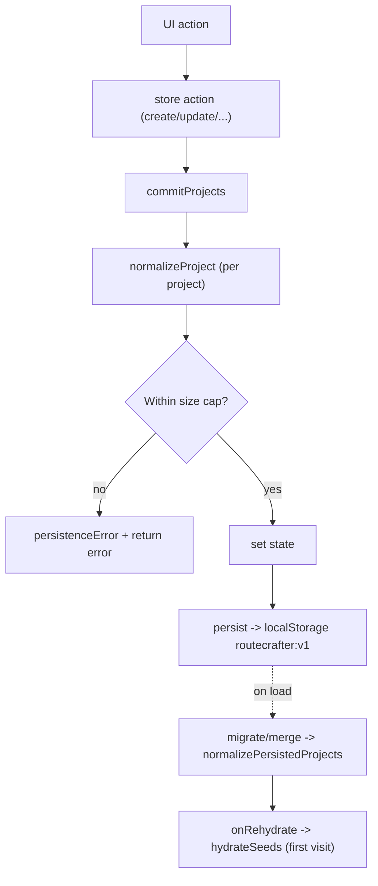

# State & Persistence

RouteCrafter has **no backend**. All application state lives in the browser, managed
by two [Zustand](https://zustand.docs.pmnd.rs) stores backed by `localStorage`. The
data model is validated and migrated through Zod on every read and write.

| Store | File | localStorage key |
| --- | --- | --- |
| Projects | [`src/lib/store/projects-store.ts`](../../src/lib/store/projects-store.ts) | `routecrafter:v1` |
| AI settings | [`src/lib/store/ai-settings-store.ts`](../../src/lib/store/ai-settings-store.ts) | `routecrafter:ai-settings:v1` |

## Projects store

### State shape

The **persisted slice** is small:

```52:55:src/lib/store/projects-store.ts
interface PersistedSlice {
  projects: Project[];
  initialized: boolean;
}
```

The full runtime state adds non-persisted fields:

| Field | Persisted? | Purpose |
| --- | --- | --- |
| `projects` | yes | All projects (Zod-normalized). |
| `initialized` | yes | Whether seeds have been applied. |
| `hasHydrated` | no | Rehydration-complete flag (for SSR gating). |
| `persistenceError` | no | User-facing storage error message. |
| `expandHint` | no | `{ duration, travelerType }` handoff from the matrix tab to the itinerary tab. |

### Actions

| Action | Behavior |
| --- | --- |
| `create(input)` | New UUID, rotating accent, `Draft` status; prepends to the list. |
| `update(id, patch)` | Shallow merge + new `updatedAt`. |
| `updateProject(id, updater)` | Functional update of a whole project. |
| `patchItinerary(projectId, itineraryId, patch)` | Patch one itinerary in place. |
| `remove(id)` | Delete a project. |
| `duplicate(id)` | Deep copy with a new id, "(Copy)" suffix, `Draft` status. |
| `getById(id)` | Lookup by id. |
| `importProject(raw)` | Normalize; assign a new id on collision. |
| `hydrateSeeds()` | Load demo projects if not yet initialized. |
| `setExpandHint` / `clearPersistenceError` | UI coordination. |

### `commitProjects`: the single write path

Every mutation routes through `commitProjects`, which normalizes, enforces a size
cap, and rolls back on failure:

```110:142:src/lib/store/projects-store.ts
      function commitProjects(projects: Project[]): MutationResult {
        const previous = get().projects;
        const normalized = projects.map(normalizeProject);
        const nextSlice = { projects: normalized, initialized: true };

        if (persistedStateSize(nextSlice) > MAX_PERSISTED_STATE_CHARS) {
          const error =
            "This change would exceed RouteCrafter's browser-storage limit. Remove an uploaded image or export and delete an older project.";
          set({ persistenceError: error });
          return { ok: false, error };
        }

        try {
          set({
            projects: normalized,
            initialized: true,
            persistenceError: null,
          });
          return { ok: true };
        } catch (error) {
          const message = storageErrorMessage(error);
          try {
            set({
              projects: previous,
              initialized: true,
              persistenceError: message,
            });
          } catch {
            // The previous persisted state was already known to fit.
          }
          return { ok: false, error: message };
        }
      }
```

Mutations return a `MutationResult` (`{ ok: true } | { ok: false, error }`) so the
UI can surface failures.

### Size guard and quota handling

Persisted state is capped at `MAX_PERSISTED_STATE_CHARS` (about 4M characters) to
avoid exceeding browser quotas — important because PDF cover/day images are stored as
data URLs. The size is measured against the exact serialized shape Zustand persists:

```88:93:src/lib/store/projects-store.ts
export function persistedStateSize(slice: PersistedSlice): number {
  return JSON.stringify({
    state: slice,
    version: CURRENT_SCHEMA_VERSION,
  }).length;
}
```

Genuine `QuotaExceededError` / `NS_ERROR_DOM_QUOTA_REACHED` failures produce a clear
message and a rollback. These messages are shown by the `PersistenceNotice`
component in the app shell.

### Persistence configuration

The store uses Zustand's `persist` middleware:

- **Key:** `routecrafter:v1`
- **Version:** `CURRENT_SCHEMA_VERSION` (2)
- **Storage:** `localStorage` (JSON)
- **`partialize`:** only `{ projects, initialized }` are persisted.
- **`migrate`:** `normalizePersistedProjects(persistedState)` re-parses everything
  through Zod, applying defaults and stamping the schema version.
- **`merge`:** also runs `normalizePersistedProjects`, so the hydrated state is
  always valid.
- **`onRehydrateStorage`:** calls `hydrateSeeds()` (loads demo projects on first
  visit) and sets `hasHydrated`.

This means schema migration is **default-driven** — there are no per-version branch
migrations. See [Data model -> Normalization](data-model.md#normalization).

### Seeds

On first visit (`initialized === false`), `hydrateSeeds()` loads the demo projects
from [`src/lib/seed-projects.ts`](../../src/lib/seed-projects.ts). Each seed is parsed
through `projectSchema`, so seeds are guaranteed valid and fully defaulted.

## AI settings store

A separate store for personal-key overrides and AI defaults, persisted under
`routecrafter:ai-settings:v1`. It holds per-provider settings (key, custom models,
last-test status/message), text defaults, and image defaults. Two safety flags are
type-locked to `true` and re-forced on rehydrate:

```81:82:src/lib/store/ai-settings-store.ts
      requirePreviewBeforeApply: true,
      showBillableConfirmation: true,
```

`hasHydrated` is runtime-only (not persisted). Full details, including the merge
strategy that layers persisted providers over defaults, are in
[AI integration -> Settings store](ai-integration.md#settings-store).

## SSR-safe hydration

Because state is loaded from `localStorage` on the client, server-rendered markup
must not assume any persisted data exists, or React will throw a hydration mismatch.
Pages that read the store gate their UI on `useMounted()`:

```13:18:src/lib/hooks.ts
export function useMounted(): boolean {
  return React.useSyncExternalStore(
    emptySubscribe,
    () => true,
    () => false,
  );
}
```

`useMounted` returns `false` on the server and the first client render, then `true`
afterward — without a `useEffect` + `setState` flash. The dashboard, projects list,
project workspace, and settings page all use it to render a skeleton/empty state
until hydration completes.

## Data flow summary



## Backups and portability

Since data is browser-local, JSON import/export is the backup/transfer mechanism.
`importProject` reuses the same normalization path and assigns a fresh id on
collision so imports are non-destructive. See
[Data model -> Import / export](data-model.md#import--export) and the
[user guide](../guides/user-guide.md#export).
