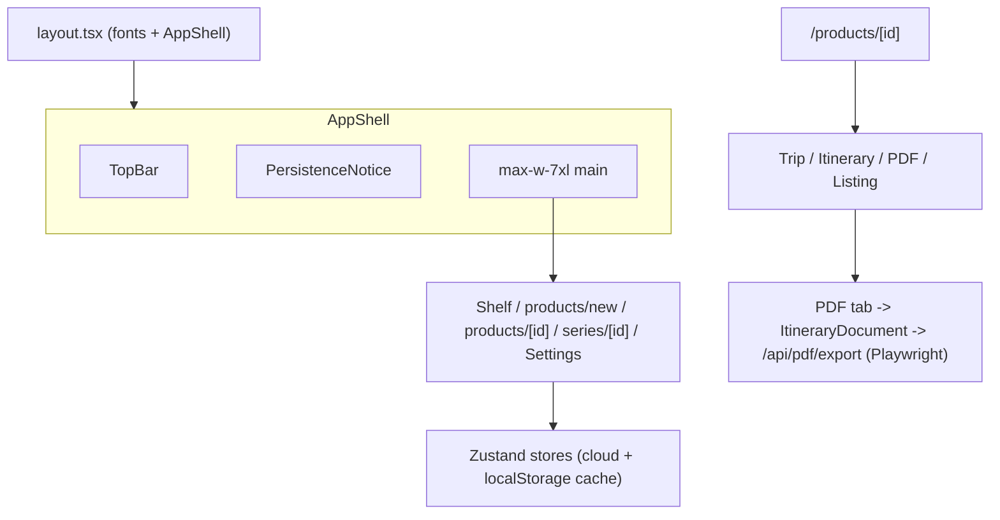

# UI & Design System

RouteCrafter's UI is a **Next.js 16 App Router** app with a single root layout, a
hand-built design system (no Radix/shadcn), a guided production workspace, and a
client-side PDF builder. Most interactive pages are `"use client"` components; the
root layout is a server component that loads fonts and wraps everything in
`AppShell`.

## Routing

There is no nested layout — every page shares the root layout only.

| Route | File | Type | Purpose |
| --- | --- | --- | --- |
| `/` | [`src/app/page.tsx`](../../src/app/page.tsx) | client | Dashboard: recent projects, quick actions, import. |
| `/projects` | [`src/app/projects/page.tsx`](../../src/app/projects/page.tsx) | client | Full project grid. |
| `/projects/new` | [`src/app/projects/new/page.tsx`](../../src/app/projects/new/page.tsx) | client | Create-project form -> workspace. |
| `/projects/[id]` | [`src/app/projects/[id]/page.tsx`](../../src/app/projects/%5Bid%5D/page.tsx) | client | Project workspace (header + `GuidedWorkspace`). |
| `/templates` | [`src/app/templates/page.tsx`](../../src/app/templates/page.tsx) | server | Roadmap placeholder (`ComingSoon`). |
| `/settings` | [`src/app/settings/page.tsx`](../../src/app/settings/page.tsx) | client | AI provider keys + defaults. |
| `/api/ai/text`, `/api/ai/image` | [`src/app/api/ai`](../../src/app/api/ai) | route handlers | Server-side AI proxy (see [AI integration](ai-integration.md)). |

### Root layout

```25:41:src/app/layout.tsx
export default function RootLayout({
  children,
}: Readonly<{
  children: React.ReactNode;
}>) {
  return (
    <html
      lang="en"
      suppressHydrationWarning
      className={`${fraunces.variable} ${inter.variable} h-full antialiased`}
    >
      <body className="rc-paper-texture min-h-full text-ink">
        <AppShell>{children}</AppShell>
      </body>
    </html>
  );
}
```

Fonts are loaded via `next/font/google`: **Fraunces** (display/serif,
`--font-fraunces`) and **Inter** (UI sans, `--font-inter`).

## AppShell & navigation

```6:21:src/components/layout/AppShell.tsx
export function AppShell({ children }: { children: React.ReactNode }) {
  return (
    <div className="flex min-h-dvh">
      <Sidebar />
      <div className="flex min-w-0 flex-1 flex-col">
        <MobileNav />
        <main className="flex-1 px-5 py-8 sm:px-8 lg:px-12 lg:py-12">
          <div className="mx-auto w-full max-w-7xl">
            <PersistenceNotice />
            {children}
          </div>
        </main>
      </div>
    </div>
  );
}
```

- **Desktop (lg+):** fixed 256px `Sidebar` + scrollable main column (`max-w-7xl`).
- **Mobile:** sticky `MobileNav` top bar; sidebar hidden.
- **`PersistenceNotice`** surfaces storage errors from the projects store
  (quota/save failures) with a dismiss action.

Navigation items live in [`nav.ts`](../../src/components/layout/nav.ts). Active state
uses prefix matching for `/projects/*` and `/settings/*`, exact match for `/`. The
sidebar also has a primary "New project" CTA and a "Prompt-output mode" callout
reminding users the app works without keys.

## UI component system

The design-system primitives live in
[`src/components/ui`](../../src/components/ui) (barrel: `index.ts`). They are
Tailwind + a `cn()` class merger (`clsx` + `tailwind-merge`), with no third-party
component library.

| Category | Components |
| --- | --- |
| Structure | `SectionHeader`, `Card` family (`CardHeader`/`CardTitle`/`CardDescription`/`CardContent`/`CardFooter`), `PreviewCard` |
| Actions | `Button` (variants `primary`/`secondary`/`outline`/`ghost`; sizes `sm`/`md`/`lg`), `CopyButton`, `ExportButton` |
| Content | `Badge` (tones: sage/terracotta/teal/gold/forest/neutral), `OutputBlock` (monospace textarea with copy header) |
| Form fields (`field/`) | `FormField`, `Label`, `Input`, `Textarea`, `Select`, `CheckboxChip` |

Conventions: pill-shaped buttons/chips, `rounded-xl` inputs, forest/sage focus
rings, paper backgrounds, soft inset shadows.

## Guided workspace

[`GuidedWorkspace`](../../src/components/workspace/guided/GuidedWorkspace.tsx)
renders five clickable route stops and persists navigation in query parameters:
`?stage=build&edition=<id>&tool=days`. Desktop uses a route line; mobile uses a
compact Stage X of 5 selector and sticky Back/Next action bar.

Stage state and recommended actions come from the pure
[`getProjectWorkflow`](../../src/lib/workflow.ts) helper. Stages never require a
manual completion toggle and remain accessible even when prerequisites are
missing. The active stage explains what is missing and links to the exact edition
or package tool.

Package tools use internal navigation for marketplace listing, packages and intake,
portfolio visuals, PDF presentation, exports, and Production tools. Prompt Studio
is therefore secondary to the sellable workflow rather than a top-level project
destination.

Each panel is described in the [user guide](../guides/user-guide.md). Notable
implementation details:

- **Trip Configuration** uses `react-hook-form` + Zod (`tripConfigurationSchema`)
  with debounced auto-save.
- **Prompt Studio** consumes the [generation engine](generation-engine.md)
  (`templatesByGroup`, `renderTemplate`) and stores output in `project.generated`.
- **Matrix / Itinerary / Listing / Image** panels combine local scaffold builders,
  a `PromptHelper` for copy-paste, and optional `AiRunSheet` flows.

## Design tokens (`globals.css`)

Tokens are defined as CSS custom properties and exposed to Tailwind via
`@theme inline` in [`globals.css`](../../src/app/globals.css).

### Palette

- **Surfaces:** ivory `#f6f1e7`, paper `#fbf8f1`, paper-2 `#f1ead9`, borders
  `#e4dbc8` / `#d6cab0`.
- **Ink:** `#2c2a24`, soft `#58534a`, muted `#8a8273`.
- **Brand:** sage, forest, terracotta, brown, teal, gold (each with soft variants).
- **AI surfaces:** a distinct gold/brown family (`--rc-ai-*`) so AI affordances read
  as "billable/premium" rather than the generic purple.

### Typography

- Body sans: Inter (`--font-sans`).
- Display serif (`.font-display`): Fraunces (`--font-serif`).
- Headings use slight negative letter-spacing.

### Other tokens & helpers

- `--radius-card: 1.25rem`; layered `--shadow-soft` / `--shadow-lift`.
- `.rc-paper-texture` (body background), `.rc-card`, `.rc-divider` utility classes.

## PDF builder {#pdf-builder}

The PDF subsystem lives in
[`src/components/workspace/pdf`](../../src/components/workspace/pdf).

| Piece | Role |
| --- | --- |
| `ItineraryDocument` | Renders a multi-page A4 document (cover, overview, day pages, guides, disclaimer) using `.rc-doc` and inline `--doc-*` theme variables. Imports `src/app/pdf.css`, the single source of document/print styles. |
| `pdf-page-model.ts` | Pagination model: splits days, detail continuations, and overlong tokens across pages. |
| `themes.ts` | Six themes (editorial, beige, sage, terracotta, teal, noir) mapped to `--doc-*` CSS variables via `themeVars(theme)`. |
| `PdfThemeControls` / `PdfTextControls` | Per-itinerary theme, cover/day images, and text controls beside the live preview. |
| `PdfBuilderPanel` | Orchestrates the preview + export from the editor's PDF tab. |

### Export paths

1. **Server export (primary)** — the editor posts `{ project, itineraryId }`
   to `POST /api/pdf/export`. The route launches Playwright Chromium,
   injects the payload into `localStorage`, renders `/pdf/print`, waits for
   fonts/images (`data-pdf-print-ready`), and returns `page.pdf()` as a
   native A4 PDF. Vercel bundling for the Chromium headless shell is
   configured in `next.config.ts`.
2. **Native print** — `/pdf/print?autoprint=1` calls `window.print()`;
   `@media print` rules in `pdf.css` hide app chrome, isolate the print
   root, force A4 page breaks, and enable `print-color-adjust: exact`.

## Broader export (non-PDF)

The editor header's Export menu (`src/components/editor/ExportMenu.tsx`) uses
helpers in
[`export-bundle.ts`](../../src/components/workspace/export/export-bundle.ts)
(`buildMarkdownBundle`, `itineraryToCsv`, `buildAiUsageAppendix`) and
[`project-io.ts`](../../src/lib/io/project-io.ts) for JSON.

## High-level UI map


