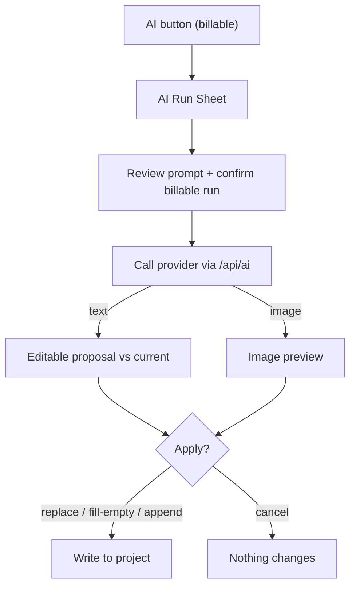

# AI Setup (Bring Your Own Key)

RouteCrafter's direct AI features are **opt-in** and use a **bring-your-own-key
(BYOK)** model. You add a provider key in Settings; the app stores it locally and
forwards it per-request to that provider through its own server route. RouteCrafter
never stores your key on a server.

> Direct AI is optional. Every panel works without a key via copy-paste prompts —
> see the [user guide](user-guide.md). If you have no key configured, AI buttons
> prompt you to add one in Settings.

## Supported providers

Configured in [`src/lib/ai/providers.ts`](../../src/lib/ai/providers.ts):

| Provider | Text | Image | Structured JSON | Default text model | Default image model |
| --- | --- | --- | --- | --- | --- |
| **OpenAI** | yes | yes | yes | `gpt-5.2` | `gpt-image-1` |
| **Anthropic** | yes | no | yes | `claude-sonnet-4-6` | — |
| **Gemini** | yes | yes | yes | `gemini-3.5-flash` | `gemini-3.1-flash-image` |

Each provider also exposes alternate models you can select, and you can supply a
custom model string.

## Configuring keys

1. Open **Settings** (`/settings`).
2. For your chosen provider, paste the API key (placeholders show the expected
   format, e.g. `sk-...`, `sk-ant-...`, `AIza...`).
3. Optionally set custom text/image model names.
4. Use **Test connection** to verify the key with a minimal request.

### Defaults you can tune

- **Text defaults:** active provider, model, temperature (default `0.7`), top-p
  (default `0.9`), max output tokens (default `4000`).
- **Image defaults:** active provider, model, size (default `1024x1024`), quality
  (default `medium`), aspect ratio (default `1:1`).

Settings persist in `localStorage` under `routecrafter:ai-settings:v1`.

## How a direct AI run works

Whenever you trigger an AI action, RouteCrafter opens the **AI Run Sheet**, which
follows a strict preview-before-apply workflow:

1. **Preview the prompt** and the provider/model that will be used.
2. **Confirm** — the run is clearly labeled **Billable** ("This may charge your
   provider account").
3. The request runs (and can be cancelled mid-flight).
4. For text, you see the proposed output (editable) next to your current content;
   for images, you see a preview.
5. **Apply** writes to your project. Nothing is written until you apply.

These two safety flags are always on and cannot be disabled:

- `requirePreviewBeforeApply`
- `showBillableConfirmation`

### Merge modes (text)

When applying text results, panels offer up to three merge modes so AI never
silently destroys your edits:

| Mode | Behavior |
| --- | --- |
| **Replace** | Overwrite the target fields with the AI output. |
| **Fill empty** | Only populate fields you've left blank. |
| **Append** | Add the AI output alongside existing content. |

### Structured (JSON) tasks

Most AI tasks request **structured JSON** that maps to a domain entity (trip config,
matrix, itinerary, day, listing, image prompt). The app strips any markdown code
fences, parses the JSON, and validates it against the relevant Zod schema before it
can be applied. If the model returns something unparseable or invalid, you get a
clear message and nothing is applied. Details in
[AI integration](../architecture/ai-integration.md).

## What each AI task does

| Where | Task | Output |
| --- | --- | --- |
| Trip Configuration | Extract config from a buyer brief | Trip configuration JSON |
| Prompt Studio | Run a generated prompt via AI | Plain text |
| Itinerary Matrix | Draft a matrix | Matrix JSON |
| Expanded Itinerary | Draft full itinerary / improve one day | Itinerary / day JSON |
| Listing Copy | Improve listing | Listing JSON |
| Image Prompts | Improve a brief / generate an image | Brief JSON / image |
| PDF Builder | Generate cover/day images | Image |

## Usage tracking and cost

RouteCrafter does **not** estimate dollar cost. Instead:

- AI actions are labeled **Billable** so you always know a real provider call will
  occur.
- When you apply an AI result, RouteCrafter records lightweight **run metadata** on
  the project (provider, model, task type, token/image usage, timestamps). This is
  surfaced in the AI-usage export appendix. It never includes your API key or the
  prompt payload.

## Security {#security}

Be aware of how keys are handled in this version:

| Aspect | Behavior |
| --- | --- |
| Storage | Keys are stored in **plaintext** in your browser's `localStorage`. They are not encrypted or synced. |
| Transit | Keys are sent in the request body from your browser to the app's own `/api/ai/*` route, which forwards them to the provider for that single request. |
| Server persistence | The server **does not store** your key — it only proxies the request. |
| Export | Project exports and the AI-usage appendix **exclude** keys and prompt payloads. |
| Route protection | The `/api/ai/*` routes are open proxies (no auth); they require a valid key in the request to do anything useful. |

Practical advice (also shown in the Settings UI):

- Do not save keys on shared or public devices.
- Remove keys before handing off a browser profile.
- Prefer provider-scoped or restricted keys where your provider supports them.

For the full technical picture, see
[AI integration -> Security](../architecture/ai-integration.md#security-considerations).
