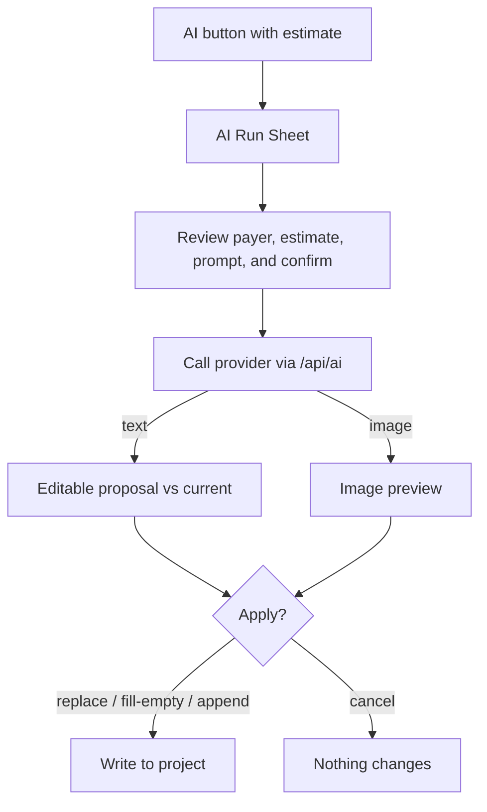

# AI Setup

RouteCrafter uses a server-side OpenAI key by default. On Vercel, configure
`OPEN_AI_KEY`; authenticated users can then run text and image generation without
adding a personal key. The server key is never returned to or stored in the
browser.

Users can save a personal provider key in Settings. A personal key for the
selected provider overrides server OpenAI for that run. Anthropic and Gemini
remain personal-key-only providers.

## Supported providers

Configured in [`src/lib/ai/providers.ts`](../../src/lib/ai/providers.ts):

| Provider | Text | Image | Structured JSON | Default text model | Default image model |
| --- | --- | --- | --- | --- | --- |
| **OpenAI** | yes | yes | yes | `gpt-5.4` | `gpt-image-2` |
| **Anthropic** | yes | no | yes | `claude-sonnet-4-6` | — |
| **Gemini** | yes | yes | yes | `gemini-3.5-flash` | `gemini-3.1-flash-image` |

Each provider also exposes alternate models you can select, and you can supply a
custom model string.

## Configuring server OpenAI

Set this environment variable in Vercel Project Settings:

```bash
OPEN_AI_KEY=sk-...
```

Server-funded requests are locked to `gpt-5.4` for text and `gpt-image-2` for
images. The authenticated `/api/ai/config` endpoint reports only whether server
OpenAI is available and the model names; it never returns the key.

## Personal key overrides

1. Open **Settings** (`/settings`).
2. For a provider, paste the API key (placeholders show the expected
   format, e.g. `sk-...`, `sk-ant-...`, `AIza...`).
3. Optionally set custom text/image model names.
4. Use **Test connection** to verify the key with a minimal request.

Saving a personal key activates it for that selected provider. Removing it
restores server OpenAI when `OPEN_AI_KEY` is configured.

### Defaults you can tune

- **Text defaults:** active provider, model, temperature (default `0.7`), top-p
  (default `0.9`), max output tokens (default `4000`).
- **Image defaults:** active provider, model, size (default `1024x1024`), quality
  (default `medium`), aspect ratio (default `1:1`).

Settings persist in `localStorage` under `routecrafter:ai-settings:v1`.

## How a direct AI run works

Whenever you trigger an AI action, RouteCrafter opens the **AI Run Sheet**, which
follows a strict preview-before-apply workflow:



1. **Preview the prompt** and the provider/model that will be used.
2. **Confirm** after reviewing the payer, credential source, model, and estimated
   USD cost range.
3. The request runs (and can be cancelled mid-flight).
4. For text, you see the proposed output (editable) next to your current content;
   for images, you see a preview.
5. **Apply** writes to your project. Nothing is written until you apply.

These two safety flags are always on and cannot be disabled:

- `requirePreviewBeforeApply`
- `showBillableConfirmation`

### Merge modes (text)

When applying text results, panels offer up to three merge modes so AI never
silently destroys your edits:

| Mode | Behavior |
| --- | --- |
| **Replace** | Overwrite the target fields with the AI output. |
| **Fill empty** | Only populate fields you've left blank. |
| **Append** | Add the AI output alongside existing content. |

### Structured (JSON) tasks

Most AI tasks request **structured JSON** that maps to a domain entity (trip config,
matrix, itinerary, day, listing, image prompt). The app strips any markdown code
fences, parses the JSON, and validates it against the relevant Zod schema before it
can be applied. If the model returns something unparseable or invalid, you get a
clear message and nothing is applied. Details in
[AI integration](../architecture/ai-integration.md).

## What each AI task does

| Where | Task | Output |
| --- | --- | --- |
| Trip Configuration | Extract config from a buyer brief | Trip configuration JSON |
| Prompt Studio | Run a generated prompt via AI | Plain text |
| Itinerary Matrix | Draft a matrix | Matrix JSON |
| Expanded Itinerary | Draft full itinerary / improve one day | Itinerary / day JSON |
| Listing Copy | Improve listing | Listing JSON |
| Image Prompts | Improve a brief / generate an image | Brief JSON / image |
| PDF Builder | Generate cover/day images | Image |

## Usage tracking and cost

RouteCrafter displays a pre-run USD estimate:

- Text estimates use a conservative prompt-token range, task-specific expected
  output, and the configured output-token cap.
- Image estimates use the selected model, image size, and quality.
- Unknown or custom models show **Estimate unavailable** rather than an invented
  price.
- Estimates may differ from final provider billing and are subject to pricing
  changes. Current OpenAI values come from the
  [pricing page](https://developers.openai.com/api/docs/pricing) and
  [image generation guide](https://developers.openai.com/api/docs/guides/image-generation).
- When you apply an AI result, RouteCrafter records lightweight **run metadata** on
  the project (provider, model, credential source, task type, token/image usage,
  timestamps). This is surfaced in the AI-usage export appendix. It never includes
  an API key or prompt payload.

## Security {#security}

Be aware of how keys are handled in this version:

| Aspect | Behavior |
| --- | --- |
| Server key | `OPEN_AI_KEY` is read only in server route handlers and is never included in client configuration or AI responses. |
| Personal-key storage | Personal keys are stored in **plaintext** in browser `localStorage`. They are not encrypted or synced. |
| Personal-key transit | A personal key is sent to `/api/ai/*` for that request and forwarded to the selected provider. |
| Server persistence | Personal keys are not persisted by the server. |
| Export | Project exports and the AI-usage appendix **exclude** keys and prompt payloads. |
| Route protection | The `/api/ai/*` routes require a valid RouteCrafter session. A personal key is optional when server OpenAI is available. |

Practical advice (also shown in the Settings UI):

- Do not save keys on shared or public devices.
- Remove keys before handing off a browser profile.
- Prefer provider-scoped or restricted keys where your provider supports them.

For the full technical picture, see
[AI integration -> Security](../architecture/ai-integration.md#security-considerations).
