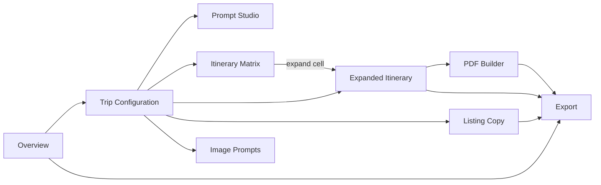

# User Guide

This guide walks through using RouteCrafter end-to-end, from the dashboard to a
finished, exportable itinerary product. Each workspace tab is covered with its
purpose, the actions available, how the free copy-paste workflow and optional AI
workflow differ, and what it exports.

> Every generation feature works without an API key. Where a tab also supports
> direct AI, that is called out explicitly. For AI configuration, see the
> [AI setup guide](ai-setup.md).

> A polished, interactive version of this guide is also embedded in the app at the
> **Guide** tab (`/guide`).

## Navigation overview

The app shell has a left sidebar (desktop) / top bar (mobile) with four
destinations:

| Destination | Route | Purpose |
| --- | --- | --- |
| Dashboard | `/` | Recent projects, quick actions, import. |
| Projects | `/projects` | Full grid of all your projects. |
| Templates | `/templates` | Roadmap placeholder. |
| Settings | `/settings` | AI provider keys and defaults. |

## Dashboard

The dashboard (`/`) shows:

- **Quick-action cards** that all lead to **New project**.
- An **Import project** button (accepts a previously exported `.json` file).
- Up to five **recent projects** as preview cards.

Click any project card to open its workspace, or **New project** to start fresh.

## Creating a project

The create form (`/projects/new`) collects the product's high-level identity:

- **Name** (required) — the project/product name.
- **Country** and **regions/cities** — the destination scope.
- **Positioning** — the one-line product angle (e.g. "Human-paced, family-friendly
  Japan with built-in rest days").
- **Target audience** — who the product is for.
- **Brand voice** — editorial, premium, friendly, or adventurous.

On submit, the project is created (with a `Draft` status and a rotating accent
color) and you are taken to its workspace.

## The project workspace

The workspace header shows the country, name, and status, plus actions to
**duplicate**, **export**, or **delete** the project. Below it is a row of nine
tabs. Tabs are switched in-place (the active tab is local UI state, not a URL).

A typical flow is: **Trip Configuration -> (Matrix) -> Expanded Itinerary -> PDF**,
with **Listing Copy** and **Image Prompts** produced alongside, and everything
collected in **Export**.

---

### Overview

A read-only summary of the project: positioning, audience, regions, durations,
traveler types, travel styles, and deliverables.

It also includes an **AI Readiness** card that checks whether you have configured
any AI provider, suggests a next AI action, and links to Settings. A gold
**"Verify before delivery"** disclaimer reminds you to confirm live data (hours,
prices, availability) before shipping a product to a buyer.

### Trip Configuration

This is the structured input that drives every other tab. It is a form backed by
validation ([`tripConfigurationSchema`](../../src/lib/schemas/trip-config.ts)) and
**auto-saves** (debounced) into the project's first trip config.

Sections include:

- **Basics** — cities, duration (with optional custom day count, 1-60), traveler
  type, arrival/departure cities and times, season/month.
- **Pace & budget** — pace (relaxed -> very active), budget tier, accommodation
  preferences.
- **Interests & constraints** — interests, food preferences, transport preferences,
  and constraints (mobility, kids, dietary, "avoid tourist traps", etc.).
- **Must-see & avoid** — free-text lists and any special occasion.

A sticky **Config Summary** mirrors your selections as you edit. Save status is
shown as idle / saving / saved / error.

**AI option:** you can paste a buyer's freeform brief and have AI extract a
structured trip configuration from it (the result is previewed and merged into the
form). See [AI integration](../architecture/ai-integration.md).

### Prompt Studio

Prompt Studio exposes all **13 generation templates**, grouped by category
(Positioning, Visuals, Itinerary, Listing, Guides). Each template turns your
project configuration into a ready-to-use, copy-paste prompt.

Actions:

- **Generate** a single template, or **Generate all**.
- Edit the generated prompt in place (it is stored on the project).
- **Copy** the prompt and run it in any external LLM, then paste the result into the
  relevant tab's fields.
- **Export** the generated prompts as a `.txt` bundle.

**AI option:** run any generated prompt directly with your provider key; the result
can be applied with replace / fill-empty / append modes.

The full template catalog is documented in
[Generation engine](../architecture/generation-engine.md).

### Image Prompts

Generates **five portfolio image briefs** for the product's marketing visuals:

1. **Hero**
2. **What you'll get**
3. **Sample itinerary**
4. **Beyond the brochure**
5. **Built around your style**

Each brief specifies the goal, canvas size, layout, visual elements, text overlay,
shared style and negative prompts, and country-accuracy / readability notes — ready
to paste into an image model (e.g. Midjourney) or to brief a designer.

Per card you can **regenerate**, **mark final**, **AI-improve** the brief, or
**AI-generate the image** itself (with a provider that supports images). Export all
five as Markdown.

### Itinerary Matrix

The matrix is a planning grid: **durations x traveler types**, where each cell holds
2-4 route **variations** (e.g. "Classic First-Timer", "Local-First Slow Travel",
and conditionally "Nature/Adventure" or "Premium Comfort"). Each variation has a
one-line route **spine** (e.g. "Tokyo -> Hakone -> Kyoto - food & culture").

Actions:

- **Generate** the matrix from your configuration (variation labels adapt to your
  travel styles, interests, and budget).
- Edit each variation's spine inline.
- **Expand** a cell: this sets a hint (duration + traveler type) and jumps you to
  the Expanded Itinerary tab, pre-filling the itinerary creator.
- **Export** the matrix as CSV or Markdown.

**AI option:** draft a richer matrix; merge with replace / fill-empty / append.
A `PromptHelper` provides the copy-paste prompt for the no-key workflow.

### Expanded Itinerary

This is the "Itinerary" tab — the full, sellable day-by-day plan. A project can hold
**multiple itineraries** (e.g. a 5-day couple version and a 10-day family version).

To create one, choose a duration, traveler type, and style, then **Create
itinerary**. The app scaffolds the days (arrival/orientation on day 1, departure on
the last day, base cities rotating across your regions) so you start from structure,
not a blank page. If you arrived via the matrix **Expand** button, those values are
pre-filled.

Each itinerary has editable top-level fields (overview, who it's for, route summary,
best stay areas, food/transport guides, packing list, etiquette & safety, booking
checklist, personalization questions, verification notes) and a **Day card** per day
with:

- Time blocks: morning, lunch, afternoon, evening, dinner.
- Transport and booking notes.
- Pace, walking intensity, optional upgrade.
- **Low-energy** and **rainy-day** alternatives.
- "Why this works" routing rationale.
- An optional day image.

**AI options:** draft an entire itinerary, improve a single day, or focus on
specific guide sections. All AI output is previewed before it is applied.

Export each itinerary as Markdown.

### Listing Copy

Produces the marketplace listing for the product (one listing per project):

- Up to five **title options**.
- **Tags** (8-12).
- **Short** and **long descriptions**.
- Tiered **packages** (e.g. Basic / Standard / Premium) with features and a price
  field you fill in.
- **FAQs**, **buyer requirements** (intake questions), and **upsells**.
- **Delivery notes**.

Choose a marketplace tone, **Generate** from templates (the scaffold ships with
substantive starter copy — prices left blank for you to set), and edit freely.
**Mark ready to sell** updates the project status. Export as Markdown.

**AI option:** AI-improve the listing; merge into existing fields.

### PDF Builder

Turns an itinerary into a themed, print-ready **A4 document**.

- Select which itinerary to render (empty state links you to the Expanded Itinerary
  tab to create one first).
- See a **live preview** of the multi-page document (cover, overview, day pages,
  guides, disclaimer).
- Use **theme controls** to pick a color theme (beige, sage, terracotta, teal,
  noir) and to set a cover image and per-day images. Uploaded images are compressed
  for local storage; you can also AI-generate cover/day images.

Two export paths:

- **Print / Save as PDF** — uses the browser print dialog with print styles that
  hide the app chrome.
- **Download PDF** — renders the document with `html2pdf.js`. The app waits for
  fonts and images to finish loading and verifies remote images can be embedded; if
  a remote image can't be captured (CORS), upload it or use the native print path
  instead.

Details in [UI & design system](../architecture/ui-and-design-system.md#pdf-builder).

### Export

The central export hub. From here you can export:

- **Full project**: JSON (re-importable) and a **Markdown bundle** (optionally with
  an AI-usage appendix).
- **Per-artifact**: matrix (CSV / Markdown), itineraries (Markdown / CSV), listing
  (Markdown), image prompts (Markdown), generated prompts (Markdown), and AI usage
  (Markdown).

The header **Export** button offers JSON + the Markdown bundle as a quick action;
the full set of per-artifact exports lives in this tab.

---

## Importing and backing up projects {#export}

Because all data is local to your browser, JSON export/import is how you back up and
move work:

- **Export JSON** (Export tab or header) downloads a single `Project` as
  pretty-printed JSON. The filename is a slug of the project name.
- **Import project** (Dashboard) reads a `.json` file, validates it against the
  project schema, fills any missing fields with current defaults, and adds it to your
  list. If the imported project's id collides with an existing one, it is given a new
  id so nothing is overwritten.

Invalid files produce a clear message (e.g. "File is not valid JSON." or a specific
field error). The exact format and validation are documented in
[Data model -> Import / export](../architecture/data-model.md#import--export).

## Tips

- **Configure once, generate everywhere.** Most tabs read from your Trip
  Configuration, so invest in that first.
- **Stay editable.** Treat generated content (prompt or AI) as a draft — edit before
  you ship.
- **Always verify live data.** RouteCrafter never invents real prices, hours, or
  availability; confirm them before delivering to a buyer.
